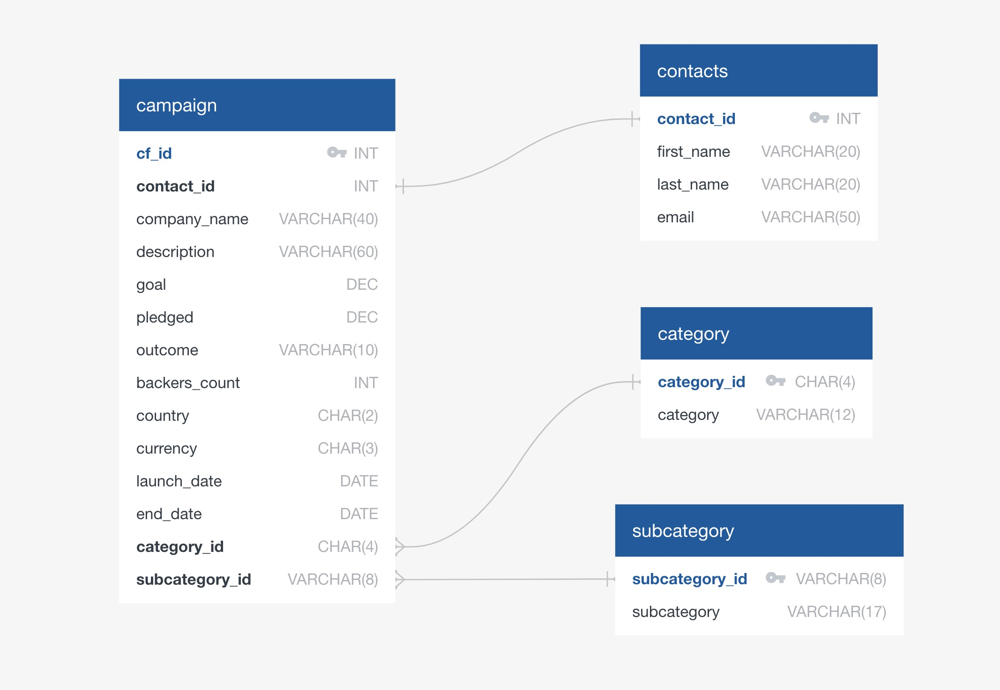

# Crowdfunding ETL
`Project 2`  
`EdX(2U) & UT Data Analytics and Visualization Bootcamp`  
`Cohort UTA-VIRT-DATA-PT-11-2024-U-LOLC`  
By:  
&nbsp;&nbsp;&nbsp;&nbsp;&nbsp;&nbsp;**Manny Guevara**,  
&nbsp;&nbsp;&nbsp;&nbsp;&nbsp;&nbsp;**Neel Agarwal**,  
&nbsp;&nbsp;&nbsp;&nbsp;&nbsp;&nbsp;**Rob LaPreze**,  
&nbsp;&nbsp;&nbsp;&nbsp;&nbsp;&nbsp;**Samora Machel**  


## Table of Contents
1. [Project Overview](#project-overview)
2. [Required Deliverables](#required-deliverables)
3. [Directory Structure](#directory-structure)
4. [System Requirements](#system-requirements)
5. [Installation & Setup](#installation--setup)
6. [ETL Process](#etl-process)
7. [Schema Creation & (Optional) Data Import](#schema-creation--optional-data-import)
8. [Regex Approach (Optional)](#regex-approach-optional)
9. [ERD Overview](#erd-overview)
10. [Usage Notes & Tips](#usage-notes--tips)
11. [Credits & Citations](#credits--citations)

---

## Project Overview

This project is designed to showcase an end-to-end **Extract, Transform, and Load (ETL)** process for crowdfunding campaign data as part of the edX/2U Data Analytics Bootcamp.

The objectives of this project are:
1. **Extract** crowdfunding data from provided Excel spreadsheets.
2. **Transform** and clean the data into a relational database-friendly format.
3. **Load** the cleaned data into a PostgreSQL database using custom SQL scripts.

The project emphasizes reproducibility and scalability by providing optional automation through notebook-driven SQL generation, all while fulfilling the assignment rubric. It avoids GUI-based imports (like pgAdmin's CSV import tool) to maintain cross-environment compatibility.

---

## Required Deliverables

According to the project rubric, the following are required:
- **`ETL_FINAL.ipynb`**: The main notebook that handles extraction, transformation, and CSV creation.
- **`crowdfunding_db_schema.sql`**: Defines the database schema for the transformed data.
- **`ERD.jpg`**: Visual representation of the Entity Relationship Diagram (ERD) of the database.

### Optional Enhancements:
- **`schema_writer.ipynb`**: Automatically generates SQL schema and import statements.
- **`crowdfunding_db_import.sql`**: Optional script to bulk-load CSVs into the database using `COPY` commands.

---

## Directory Structure

```plaintext
Crowdfunding_ETL/
│
├── ETL/
│   ├── Deliverables/
│   │   ├── crowdfunding_db_schema.sql (Required)
│   │   └── ETL_FINAL.ipynb (Required)
│   └── Extras/
│       ├── crowdfunding_db_import.sql (Optional)
│       └── schema_writer.ipynb (Optional)
│
├── Resources/
│   ├── Input/
│   │   ├── contacts.xlsx
│   │   └── crowdfunding.xlsx
│   └── Output/
│       ├── campaign.csv
│       ├── category.csv
│       ├── contacts.csv
│       └── subcategory.csv
│
├── .gitignore
├── ERD.jpg (Required)
└── README.md
```

---

## System Requirements

To successfully run this project, the following environment is recommended:

- **Operating System**: macOS, Windows, or Linux
- **Python Version**: 3.9 or higher
- **PostgreSQL**: Version 13 or higher
- **Required Python Libraries**:
  - `pandas`
  - `numpy`
  - `pathlib` (built-in)
  - `re` (built-in)
  - `json` (built-in)
  - `datetime` (built-in)
- **Jupyter Notebook**: For running `.ipynb` files (install via `pip install notebook` if needed)
- **PostgreSQL GUI (optional)**: pgAdmin 4 or any compatible interface
- **Disk Space**: Minimum 500 MB free
- **Memory (RAM)**: Minimum 4 GB recommended

### Installation Summary
```bash
pip install pandas numpy notebook
```

Ensure PostgreSQL is installed and running before executing the SQL scripts.

---

## Installation & Setup

1. **Clone or download** this repository.
2. Ensure you have **Python 3.x** installed with **pandas**:
   ```bash
   pip install pandas
   ```
3. (Optional) Set up a virtual environment:
   ```bash
   python -m venv venv
   source venv/bin/activate  # Mac/Linux
   venv\Scripts\activate     # Windows

   
   ```

---

## ETL Process

### 1. Extraction
- Read `crowdfunding.xlsx` and `contacts.xlsx`.
- Clean the datasets by removing unnecessary columns and standardizing data types.

### 2. Transformation
- Split `"category & sub-category"` into separate `"category"` and `"subcategory"`.
- Create four CSVs: `campaign.csv`, `contacts.csv`, `category.csv`, `subcategory.csv`.

### 3. Loading
- Load CSVs into PostgreSQL using `crowdfunding_db_schema.sql`.
- Optionally load data via `crowdfunding_db_import.sql`.

---

## Schema Creation & (Optional) Data Import

### Note on VARCHAR Lengths:

The `VARCHAR` lengths for variable fields (like `first_name`, `last_name`, `email`, `company_name`, and `description`) were determined by the maximum string lengths from the dataset. These lengths were **manually rounded up** to accommodate longer entries in future datasets, preventing any data truncation issues.

### Example Table Creation
```sql
CREATE TABLE campaign (
    cf_id CHAR(5) NOT NULL,
    contact_id INT NOT NULL,
    company_name VARCHAR(60),
    description VARCHAR(60),
    goal DEC,
    pledged DEC,
    outcome VARCHAR(10),
    backers_count INT,
    country CHAR(2),
    currency CHAR(3),
    launch_date DATE,
    end_date DATE,
    category_id CHAR(4),
    subcategory_id VARCHAR(8)
);
```

### Example Import (Optional)
```sql
COPY campaign
FROM '/your/local/path/Resources/Output/campaign.csv'
DELIMITER ','
CSV HEADER;
```

### Usage
```sql
\i crowdfunding_db_schema.sql
-- Optional:
\i crowdfunding_db_import.sql
```

---

## Regex Approach (Optional)

An alternative method explored involved using **regular expressions** to extract fields from semi-structured text. This was ultimately replaced by pandas-based logic for efficiency.

### Example Regex Parsing
```python
import re

pattern_id = r'\d{4}'
pattern_email = r'"email": "(.+)"'
pattern_name = r'(\w+\s\w+)'

for row in contact_info_df['raw_data_column']:
    found_id = re.search(pattern_id, row).group()
    found_email = re.search(pattern_email, row).group(1)
    found_name = re.search(pattern_name, row).group()
```

---

## ERD Overview



### Normalization:

This database schema follows **normalization** principles to minimize redundancy, maintain data integrity, and ensure scalability. By splitting data into tables like `category`, `subcategory`, `contacts`, and `campaign`, we:
- Reduce repeated data entries.
- Simplify updates to shared information.
- Improve database performance.

For example:
- Categories and subcategories are separated to prevent repeated text entries in multiple campaigns.
- Contacts are stored independently to link multiple campaigns to a single contact entry.

### Relationships:
- `campaign.contact_id` → `contacts.contact_id`
- `campaign.category_id` → `category.category_id`
- `campaign.subcategory_id` → `subcategory.subcategory_id`

---

## Usage Notes & Tips

- Update file paths if moving files.
- Enhance the schema with constraints as needed.
- Regenerate schema with `schema_writer.ipynb` if CSV structures change.

---

## Credits & Citations

1. **Author**: _[Your Name]_ - UT/edX/2U Data Analytics Bootcamp, Project 2.
2. **Starter Code & Data**: Provided by **edX/2U**.
3. **ChatGPT**: Assisted in README drafting.
4. **PostgreSQL Docs**: [postgresql.org/docs](https://www.postgresql.org/docs/)
5. **pandas Docs**: [pandas.pydata.org/docs](https://pandas.pydata.org/docs)

---

Thank you for exploring the Crowdfunding ETL project! Contributions and feedback are welcome.

---